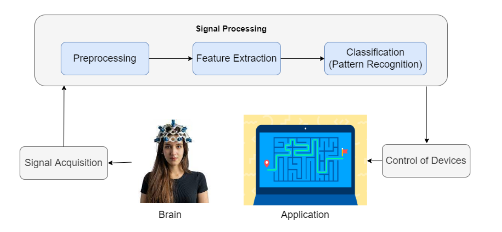

[comment]: # "This is the standard layout for the project, but you can clean this and use your own template"

# Enhancing Video Game Experience With Brain Computer Interface

1. [Abstract](#abstract)
2. [Related works](#related-works)
3. [Methodology](#methodology)
4. [Experiment Setup and Implementation](#experiment-setup-and-implementation)
5. [Results and Analysis](#results-and-analysis)
6. [Conclusion](#conclusion)
7. [Publications](#publications)
8. [Links](#links)

## Abstract

Electroencephalogram (EEG) based Brain-Computer Interfaces (BCIs) were primarily developed to assist individuals with motor disabilities. However, recent studies have investigated the potential of EEG-based BCIs for non-clinical applications, such as gaming. Researchers have found that using non-motor imagery can be an effective way to provide control commands in BCI applications. Various techniques have been explored to decode non-motor imagery tasks using EEG. Inner speech, which is a non-motor imagery task, is a form of self-directed speech produced in mind. In this study we used the inner speech paradigm to decode four control commands namely, left, right, up and down, that can be used for controlling a simple navigation game. Independent Component Analysis (ICA) and Continuous wavelet transform (CWT) were considered as the signal preprocessing techniques. With application of transfer learning for Convolutional Neural Network (CNN), Resnet50, we classified the EEG signals from 9 subjects. The results showed accuracies of 100%, 45%, 20% and 90% for different ratios of training and test data. 

## Related works

## Methodology

Brain-Computer Interface (BCI) is a collaboration between a brain and a device that enables signals from the brain to direct some external activity. In this project, four control actions (left, right, up, and down) will be performed in a video game using BCI. In this approach, inner speech commands will be used as the method to control the video game application. The inner speech, also referred to as verbal thinking, is a form of self-directed speech produced in mind.

One of the main steps in this project is to acquire brain signals related to inner speech. The data acquisition technique to be used is electroencephalography (EEG) which is a non-invasive data acquisition technique. It is aimed to achieve a higher level of performance by capturing the most relevant signals with the use of eight
electrodes.

The signal enhancement and feature extraction will be done using signal processing techniques like signal filtering, independent component analysis (ICA), continuous wavelet transform(CWT) , and short-time Fourier transform (STFT). Then, signals will be classified into five categories using the artificial neural network technique as up, down, left, right, and none. These classified commands are fed into the real-time application.

## Experiment Setup and Implementation

### Subjects
This study involved 9 healthy, right-handed subjects with a mean age of 25 years, of whom 4 were male and 5 were female. The subjects had no speech or hearing loss, no neurological, movement, or psychiatric disorders. All of the subjects gave their written, informed consent. These subjects had no prior BCI experience.

### Data acquisition
The experiment was designed to acquire data from the subjects. Inner speech paradigm was used throughout the experiment.The inner speech paradigm is a psychological concept that refers to the way people talk to themselves silently in their minds.
The final outcome of the conducted research was to control the simple navigation game using four different mind commands. They were up, down, left, and right. In the experiment, the collected data was related to these mind commands of the subjects.
A GUI was developed and used to guide the subject with what to think and when to think. Pyqt5 designer in python was used to design the experiment GUI. Initially, the subject was given a concentration interval of 0.5 seconds. In the next 0.5 seconds interval, the cue was shown up. The cue refers to the direction. After that, the action interval was shown for 2.5 seconds. Within the action interval, the subject was supposed to pronounce the shown direction in mind. Next, the subject was given a relax interval of 1 second and rest interval of 1.5 seconds. 

## Results and Analysis

## Conclusion

## Publications
[//]: # "Note: Uncomment each once you uploaded the files to the repository"

<!-- 1. [Semester 7 report](./) -->
<!-- 2. [Semester 7 slides](./) -->
<!-- 3. [Semester 8 report](./) -->
<!-- 4. [Semester 8 slides](./) -->
<!-- 5. Author 1, Author 2 and Author 3 "Research paper title" (2021). [PDF](./). -->

#### Team

- E/16/012,  Isurika Adikari, [email](mailto:e16012@eng.pdn.ac.lk)
- E/16/081, J.M.Praveen Dhananjaya, [email](mailto:e16081@eng.pdn.ac.lk)
- E/16/200, Sumudu Liyanage, [email](mailto:e16200@eng.pdn.ac.lk)

#### Supervisors

- Dr. Isuru Nawinne, [email](mailto:isurunawinne@eng.pdn.ac.lk)
- Prof. Roshan G. Ragel, [email](mailto:roshanr@eng.pdn.ac.lk)
- Dr. Mahanama Wickramasinghe, [email](mailto:mahanamaw@eng.pdn.ac.lk)
- Mr. Theekshana Dissanayake, [email](mailto:theekshanadis@eng.pdn.ac.lk)

#### Table of content

## Links

[//]: # ( NOTE: EDIT THIS LINKS WITH YOUR REPO DETAILS )

- [Project Repository](https://github.com/cepdnaclk/e16-4yp-Enhancing-Video-Game-Experience-With-Brain-Computer-Interface)
- [Project Page](https://cepdnaclk.github.io/e16-4yp-Enhancing-Video-Game-Experience-With-Brain-Computer-Interface/)
- [Department of Computer Engineering](http://www.ce.pdn.ac.lk/)
- [University of Peradeniya](https://eng.pdn.ac.lk/)

[//]: # "Please refer this to learn more about Markdown syntax"
[//]: # "https://github.com/adam-p/markdown-here/wiki/Markdown-Cheatsheet"
